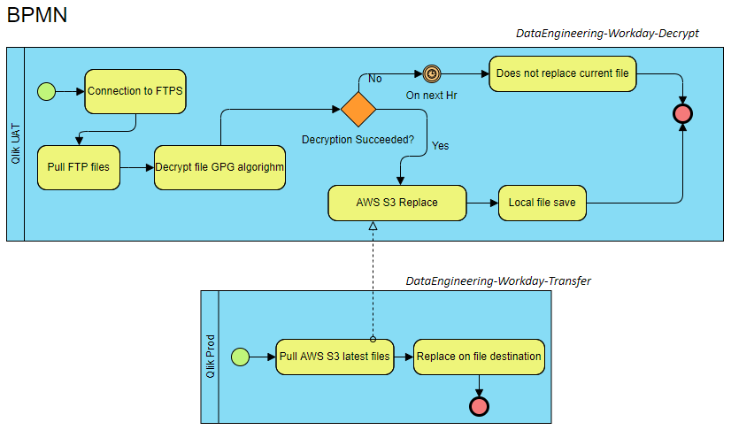
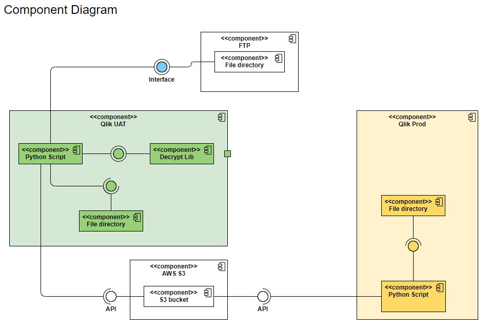

# DataEngineering-Workday-Transfer
DataEngineering-Workday-Transfer is a process that pulls objects from an S3 bucket and moves the downloaded data across the OS, we receive several different updates every day, files are in following format: “prefix/year/month/day/FILENAME.csv_decrypted.csv”, example “<prefix>/2020/07/30/TerminationsByOrganization.csv_decrypted.csv”.

The process takes the current day files (based on timezone('US/Central')) and transfer them locally to the server where this script is running, after that files are moved to a specific location.

This repo is part of a project that that has decouple the architecture in two different scripts “DataEngineering-Workday-Decrypt” & “DataEngineering-Workday-Transfer”, here is the BPMB and its component diagram.

### BPMB


### Components Diagram


### Tech
DataEngineering-Workday-Transfer uses the following tech stack:

* Python 3.7
* Windows 7+

### Local Testing

Requires [Python](https://docs.conda.io/en/latest/miniconda.html) v3.7+ to run.

Install the dependencies

```sh
$ cd DataEngineering-Workday-Transfer
$ conda create -n workday-decrypt python=3.7
$ conda activate workday-decrypt
$ pip install --upgrade -r requirements.txt
$ # Add AWS credentials and Directory location
$ python main.py
```

#### Building for source
if new lib added to the project update requirements.txt
```sh
$ pip freeze --local > requirements.txt
```

### Docker

```sh
FROM python:3
WORKDIR /usr/src/app
COPY requirements.txt ./
RUN pip install --no-cache-dir -r requirements.txt
COPY . .
CMD [ "python", "./your-daemon-or-script.py" ]
```

## Authors
* **Luis Fuentes** - *2020-08-02*